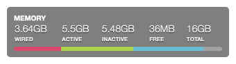

# Memory Usage

A simple Memory Usage widget for Übersicht using the colors from [Monokai Faded](https://dionmunk.com/projects/monokai-faded/). Based on [ubericht-memory-bar](https://github.com/cobyism/ubersicht-memory-bar).

## Screenshot

## Installation

- Download the [repository](https://github.com/dionmunk/ubersicht-memory-usage/archive/master.zip) and extract it.
- Place the `memory-usage.widget` folder in your Ubersicht extension folder.
- Refresh Ubersicht.

## License

This work is licensed under a [Creative Commons Attribution-NonCommercial 4.0 International License](https://creativecommons.org/licenses/by-nc/4.0/).
